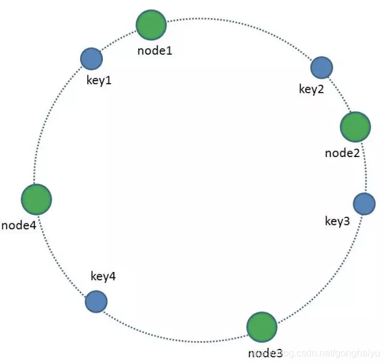
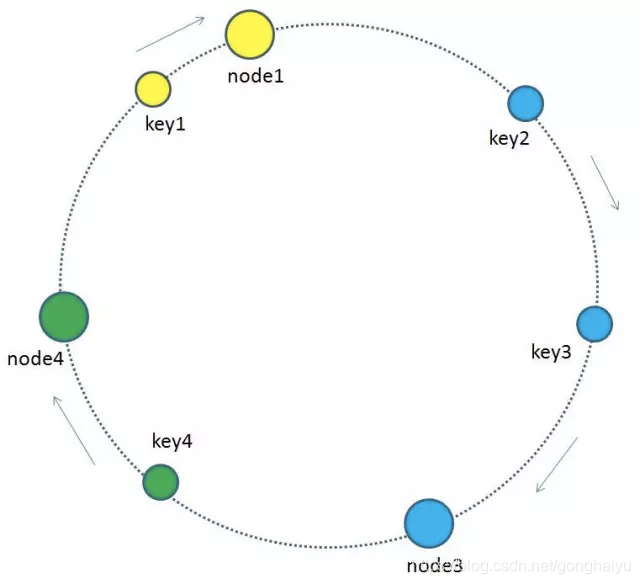
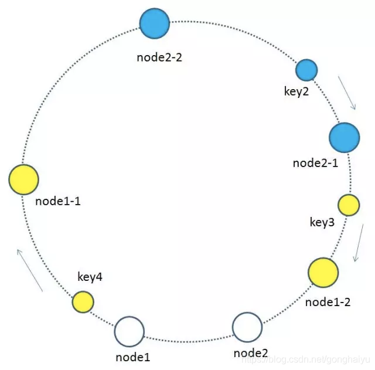

# 长短链
学习的一个项目，长链接转短链接，主要是hash，缓存，Ip限流

如果分布式部署话，redis就需要用一致性hash算法，避免缓存雪崩

## 技术栈
springboot + thymeleaf

存储层：MySQL

缓存层：LRUCache，redis，布隆过滤器

布隆过滤器主要用于优化存储，LRUCache，redis主要用于优化查询

业务：302重定向，MurmurHash计算hash，MurmurHash 就是一种非加密型哈希算法，与 MD5、SHA 等常见哈希函数相比，性能与随机分布特征都要更佳。MurmurHash 有 32 bit、64 bit、128 bit 的实现，32 bit 已经足够表示近 43 亿个短链接

采用302而不是301的原因在于301 为永久重定向、302 为临时重定向，因为302便于统计网站的访问次数。

一致性hash减少缓存雪崩

参考
https://hardcore.feishu.cn/docs/doccnAfY0f35ZgnrFg7jSTQmOOf

https://github.com/Naccl/ShortURL

## 技术设计
1. 读与写
这个项目是一个少写多读的项目，那么需要对读写进行优化。

目前对于写，采用布隆过滤器，减少写的次数

对于读，采用LRUCache或者LFUCache以及redis进行优化。

测试过，写大概200ms，读100ms不到。

## TODO
- [ ] ip黑白名单
- [ ] 支持自定义格式

## 后期扩展
希望实现一致性hash算法，因为读是很多的，可能存在redis多机部署，那么就设置对于ip进行分流，采用一致性hash算法，均匀达到每一台机器的redis上。

一致性hash是分布式系统组件负载均衡的首选算法，比如分库分表

### 举分布式缓存的例子
分布式缓存是将文件存储在多个服务器里，然后按照一定的算法进行计算。对于普通的hash
用一个数字对服务器数进行取模，得到的结果就是我要访问的服务器编号。
但是如果增加了一台服务器，那么用同样的方法，得到的服务器编号就发生了改变了。

一致性hash算法就是希望在增加或减少服务器前后，我对应的服务器编号都不变。
缓存失效，造成缓存雪崩

### 一致性hash
1. 首先，我们将hash算法的值域映射成一个具有2的32次方个桶的空间中，即0~（2的32次方）-1的数字空间。现在我们可以将这些数字头尾相连，组合成一个闭合的环形。
2. 每一个缓存key都可以通过Hash算法转化为一个32位的二进制数，也就对应着环形空间的某一个缓存区。我们把所有的缓存key映射到环形空间的不同位置。
3. 我们的每一个缓存服务器也遵循同样的Hash算法，比如利用IP或者主机名做Hash，映射到环形空间当中，如下图

那么如何让key和缓存服务器对应起来呢
每一个key的瞬时间方向最近服务器，就是key所归属的缓存服务器，

当缓存的服务器有增加或删除的时候，一致性哈希的优势就显示出来了。

https://blog.csdn.net/gonghaiyu/article/details/108375298

hash偏斜，即hash不均匀
那么大部分的key都落到一台服务器上了，这个服务器宕机就会出现缓存雪崩
那么如果说我服务器够多，hash就会均匀

### 一致性hash升级
引入虚拟节点，对于每一个服务器，映射出多个虚拟节点，然后放在hash环上，那么就会使得环上的服务器尽可能均匀了

